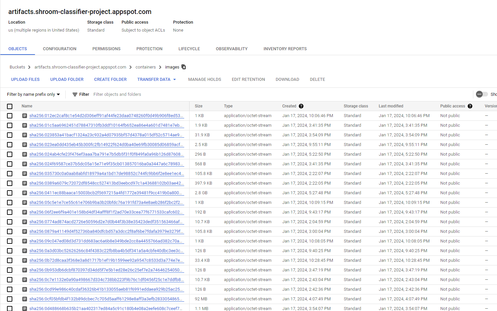
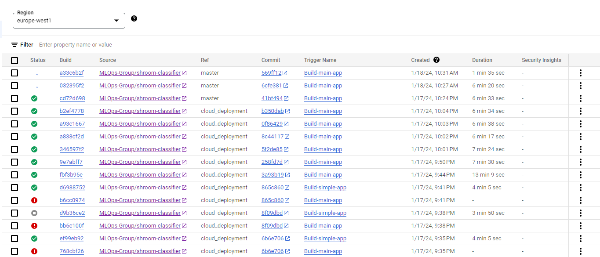
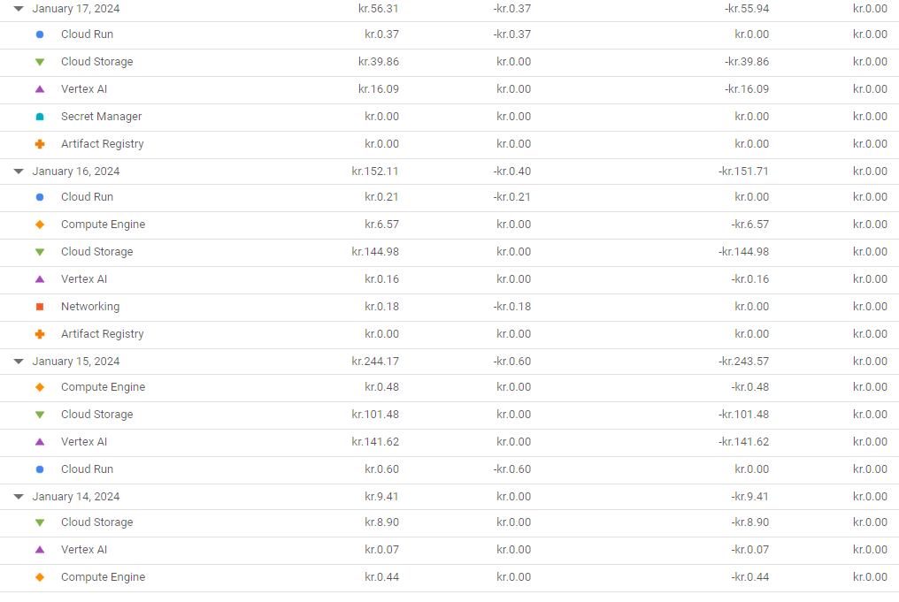

# Exam template for 02476 Machine Learning Operations

This is the report template for the exam. Please only remove the text formatted as with three dashes in front and behind
like:

```--- question 1 fill here ---```

where you instead should add your answers. Any other changes may have unwanted consequences when your report is auto
generated in the end of the course. For questions where you are asked to include images, start by adding the image to
the `figures` subfolder (please only use `.png`, `.jpg` or `.jpeg`) and then add the following code in your answer:

```markdown

```

In addition to this markdown file, we also provide the `report.py` script that provides two utility functions:

Running:

```bash
python report.py html
```

will generate an `.html` page of your report. After deadline for answering this template, we will autoscrape
everything in this `reports` folder and then use this utility to generate an `.html` page that will be your serve
as your final handin.

Running

```bash
python report.py check
```

will check your answers in this template against the constrains listed for each question e.g. is your answer too
short, too long, have you included an image when asked to.

For both functions to work it is important that you do not rename anything. The script have two dependencies that can
be installed with `pip install click markdown`.

## Overall project checklist

The checklist is *exhaustic* which means that it includes everything that you could possible do on the project in
relation the curricilum in this course. Therefore, we do not expect at all that you have checked of all boxes at the
end of the project.

### Week 1

* [X] Create a git repository
* [X] Make sure that all team members have write access to the github repository
* [X] Create a dedicated environment for you project to keep track of your packages
* [X] Create the initial file structure using cookiecutter
* [X] Fill out the `make_dataset.py` file such that it downloads whatever data you need and
* [X] Add a model file and a training script and get that running
* [X] Remember to fill out the `requirements.txt` file with whatever dependencies that you are using
* [X] Remember to comply with good coding practices (`pep8`) while doing the project
* [X] Do a bit of code typing and remember to document essential parts of your code
* [X] Setup version control for your data or part of your data
* [X] Construct one or multiple docker files for your code
* [X] Build the docker files locally and make sure they work as intended
* [X] Write one or multiple configurations files for your experiments
* [X] Used Hydra to load the configurations and manage your hyperparameters
* [ ] When you have something that works somewhat, remember at some point to to some profiling and see if
      you can optimize your code
* [X] Use Weights & Biases to log training progress and other important metrics/artifacts in your code. Additionally,
      consider running a hyperparameter optimization sweep.
* [X] Use Pytorch-lightning (if applicable) to reduce the amount of boilerplate in your code

### Week 2

* [X] Write unit tests related to the data part of your code
* [X] Write unit tests related to model construction and or model training
* [X] Calculate the coverage.
* [X] Get some continuous integration running on the github repository
* [X] Create a data storage in GCP Bucket for you data and preferable link this with your data version control setup
* [X] Create a trigger workflow for automatically building your docker images
* [X] Get your model training in GCP using either the Engine or Vertex AI
* [X] Create a FastAPI application that can do inference using your model
* [ ] If applicable, consider deploying the model locally using torchserve
* [ ] Deploy your model in GCP using either Functions or Run as the backend

### Week 3

* [ ] Check how robust your model is towards data drifting
* [ ] Setup monitoring for the system telemetry of your deployed model
* [ ] Setup monitoring for the performance of your deployed model
* [X] If applicable, play around with distributed data loading
* [ ] If applicable, play around with distributed model training
* [ ] Play around with quantization, compilation and pruning for you trained models to increase inference speed

### Additional

* [ ] Revisit your initial project description. Did the project turn out as you wanted?
* [ ] Make sure all group members have a understanding about all parts of the project
* [ ] Uploaded all your code to github

## Group information

### Question 1
> **Enter the group number you signed up on <learn.inside.dtu.dk>**
>
> Answer:

Group: 35

### Question 2
> **Enter the study number for each member in the group**
>
> Example:
>
> *sXXXXXX, sXXXXXX, sXXXXXX*
>
> Answer:

s174139, s180820, s183920, s183922

### Question 3
> **What framework did you choose to work with and did it help you complete the project?**
>
> Answer length: 100-200 words.
>
> Example:
> *We used the third-party framework ... in our project. We used functionality ... and functionality ... from the*
> *package to do ... and ... in our project*.
>
> Answer:

In our project, we leveraged the [TIMM](https://huggingface.co/timm) framework, a comprehensive library developed by Hugging Face, known for its extensive collection of pre-trained models and utilities. One of the key features of TIMM that we utilized is its pre-trained version of the ResNet50 model. This model, renowned for its performance in image classification tasks, served as the backbone of our custom classifier. We fine-tuned this model by encapsulating it within a PyTorch Lightning module, a high-level interface that simplifies the training process and enhances reproducibility. This allowed us to harness the power of the ResNet50 architecture, while customizing it to suit our specific needs. Additionally, TIMM provides a handy tool, `timm.data.transforms_factory.create_transform`, which we used for image preprocessing. This function enabled us to perform a series of transformations on our images, including normalization and cropping, thereby ensuring that our images were in the optimal format for input into our model. This combination of pre-trained models and utility functions made TIMM an invaluable resource in our project.


## Coding environment

> In the following section we are interested in learning more about you local development environment.

### Question 4

> **Explain how you managed dependencies in your project? Explain the process a new team member would have to go**
> **through to get an exact copy of your environment.**
>
> Answer length: 100-200 words

To mangage our dependencies we used our favorite choice of virtural environments manager. For the majority of our group that is miniconda. To see a list of dependencies check out `requirements.txt` and `requirements_dev.txt` (for development dependencies).
To get up to data with a fully functional working environemt using conda, you simply need to run
```bash
make create_environemnt
make requirements
make requirements_dev
```
The detailed commands are found in the `Makefile` of the project.

### Question 5

> **We expect that you initialized your project using the cookiecutter template. Explain the overall structure of your**
> **code. Did you fill out every folder or only a subset?**
>
> Answer length: 100-200 words
>
> Example:
> *From the cookiecutter template we have filled out the ... , ... and ... folder. We have removed the ... folder*
> *because we did not use any ... in our project. We have added an ... folder that contains ... for running our*
> *experiments.*
> Answer:

We have sticked very much to the cookiecutter template provided in the course. The source folder (containing the source code for this project) is named `shroom_classifier`. We have not used any notebooks and have, therefore, removed this folder from the project. 
We have added a folder name `dockerfiles` to keep all dockerfiles together.

In the source code folder, `shroom_classifier`, we have added a folder called `app` for our deployed application. It contains code for a FastAPI application and streamlit application for frontend. We have also included a `utils` folder to add potential util-functions. 

The cookiecutter-template report folder was replaced with this folder.

### Question 6

> **Did you implement any rules for code quality and format? Additionally, explain with your own words why these**
> **concepts matters in larger projects.**
>
> Answer length: 50-100 words.
>
> Answer:

Github Actions 


## Version control

> In the following section we are interested in how version control was used in your project during development to
> corporate and increase the quality of your code.

### Question 7

> **How many tests did you implement and what are they testing in your code?**
>
> Answer length: 50-100 words.
>
> Example:
> *In total we have implemented X tests. Primarily we are testing ... and ... as these the most critical parts of our*
> *application but also ... .*
>
> Answer:

We have implemented 15 tests which covers model steps, predictions, data loading, visualisations and FastAPI testing which also looks at datadrifting and monitoring. We wanted to focus on making the model work and make sure that we could get our API up and running for the future interface as this is what brings our product to life. 

### Question 8

> **What is the total code coverage (in percentage) of your code? If you code had an code coverage of 100% (or close**
> **to), would you still trust it to be error free? Explain you reasoning.**
>
> Answer length: 100-200 words.
>
> Example:
> *The total code coverage of code is X%, which includes all our source code. We are far from 100% coverage of our **
> *code and even if we were then...*
>
> Answer:

The total code coverage percentage is 85% which looks at all of our source code. We are a little way from 100% but we still managed to check most of it.

Few files were ignored in the pyproject.toml file such as make_dataset and a simple fastAPI app for testing purposes only as it is only run once or never used in the final pipeline.

Even while having doing tests that should cover all of your source code, there will always be a possibility of errors. It could be poorly implemented tests or tests that works isolated, but does not work in collaboration f.x. a function gives an output as input for another function but this relation is not being tested.

### Question 9

> **Did you workflow include using branches and pull requests? If yes, explain how. If not, explain how branches and**
> **pull request can help improve version control.**
>
> Answer length: 100-200 words.
>
> Example:
> *We made use of both branches and PRs in our project. In our group, each member had an branch that they worked on in*
> *addition to the main branch. To merge code we ...*
>
> Answer:

Our project utilized both branches and pull requests. As we made use of the GitHub issues and project for managing tasks, each task was completed in a seperate branch. After completion and ensuring that the master branch could successfully be merged into the branch, the branch was merged into the master branch. In the beginning this was done using simple merging, however, after the testing workflow was successfully set up, the merging was done using pull requests after passing all the tests succesfully.

### Question 10

> **Did you use DVC for managing data in your project? If yes, then how did it improve your project to have version**
> **control of your data. If no, explain a case where it would be beneficial to have version control of your data.**
>
> Answer length: 100-200 words.
>
> Example:
> *We did make use of DVC in the following way: ... . In the end it helped us in ... for controlling ... part of our*
> *pipeline*
>
> Answer:


We did use DVC in our project. It was usefull for easily sharing access to data among the team members. 

Our data, however, was part of a 2018 Kaggle Competetion and was downloaded as .tgz file and hence quite static. Consequently, we only used one version of our data. 
Furthermore, preprocessing is done in the torch.dataset class we implemented for the project and hence we only store raw data. 
We do no really expect that we will need newer versions of data as we will just add new images to the same bucket.

Perhaps, if we were to do some kind of data augmentation, such as rotataing or adding noise to the images, we might like to keep the original version intact and then DVC would be beneficial.


### Question 11

> **Discuss you continues integration setup. What kind of CI are you running (unittesting, linting, etc.)? Do you test**
> **multiple operating systems, python version etc. Do you make use of caching? Feel free to insert a link to one of**
> **your github actions workflow.**
>
> Answer length: 200-300 words.
>
> Example:
> *We have organized our CI into 3 separate files: one for doing ..., one for running ... testing and one for running*
> *... . In particular for our ..., we used ... .An example of a triggered workflow can be seen here: <weblink>*
>
> Answer:

In our project we created four different CI files. The first two are setup using the GitHub workflows tool and performs unit testing and linting respectively. The main workflow here, is the testing workflow implemented in https://github.com/MLOps-Group/shroom-classifier/blob/master/.github/workflows/tests.yml. When triggered, this workflow setup the used Python version and installed the necesary requirements using the `actions/setup-python@v5` GitHub action and the ``cache: 'pip' argument for caching the Python packages. After setting up Python the workflow was given access to our google Google Cloud Bucket and downloaded a small data sample which could be used for performing the unit tests created in the project's test folder.
The last two are implemented as Google Cloud Triggers. Here one trigger executes the training of a new model and the second deploys the API for for performing inference using the model.


## Running code and tracking experiments

> In the following section we are interested in learning more about the experimental setup for running your code and
> especially the reproducibility of your experiments.

### Question 12

> **How did you configure experiments? Did you make use of config files? Explain with coding examples of how you would**
> **run a experiment.**
>
> Answer length: 50-100 words.
>
> Example:
> *We used a simple argparser, that worked in the following way: python my_script.py --lr 1e-3 --batch_size 25*
>
> Answer:

We used Hydra and config files. The configurations are found in the configs folder.
An example of a experiment could be
```python 
python shroom_classifier/train_model train_configs.model.lr=0.001 train_configs.trainer.max_epochs=20
```
We have structured configs as follows:


```text
|-configs
      |-train_config
            |-train_default.yaml
            |-experiment1.yaml
            |-...
      |-pytest_config
            |-test_values.yaml
            |-train_model_test.yaml
      |-conifg.yaml
```

Additionally, we used Weights and Biases to log and monitor training. Config files including all hyperparameters were also saved to wandb.
After each validation epoch a model was saved if it was the best performing measured in accuracy so far.

### Question 13

> **Reproducibility of experiments are important. Related to the last question, how did you secure that no information**
> **is lost when running experiments and that your experiments are reproducible?**
>
> Answer length: 100-200 words.
>
> Example:
> *We made use of config files. Whenever an experiment is run the following happens: ... . To reproduce an experiment*
> *one would have to do ...*
>
> Answer:


When an experiment is run the config files is saved by Hydra to the logs folder and also added to the wandb run and saved there. 

To reproduce an experiment go to the corresponding wandb run and download the config file (config.yaml) and save it to the train config folder. If you for instance want to rerun a training: 
```bash
python shroom_classifier/train_model.py train_config=config
```
All the configurations are handled by Hydra and config files and if you want to change a hyperparameter you will write it to config - Doing so we ensure that no information is lost.


### Question 14

> **Upload 1 to 3 screenshots that show the experiments that you have done in W&B (or another experiment tracking**
> **service of your choice). This may include loss graphs, logged images, hyperparameter sweeps etc. You can take**
> **inspiration from [this figure](figures/wandb.png). Explain what metrics you are tracking and why they are**
> **important.**
>
> Answer length: 200-300 words + 1 to 3 screenshots.
>
> Example:
> *As seen in the first image when have tracked ... and ... which both inform us about ... in our experiments.*
> *As seen in the second image we are also tracking ... and ...*
>
> Answer:


In the following wandb images we compare to models starting with to different initial learning rates. The learning rate is updated using a scheduler and shown in the first image below.
```markdown

```
The second image shows the validation steps after each training epoch. Here it appears that the model with the higher initial learning rate (brown) overfits the training data as the validation loss rises. However, it is still this model which performs best when comparing the other classification metrics.  

```markdown

```

The third image shows logs of the training loss where each 20th bathc loss and classification metrics are logged. Againg the model in the brown run performs well on the training data.

```markdown

```


### Question 15

> **Docker is an important tool for creating containerized applications. Explain how you used docker in your**
> **experiments? Include how you would run your docker images and include a link to one of your docker files.**
>
> Answer length: 100-200 words.
>
> Example:
> *For our project we developed several images: one for training, inference and deployment. For example to run the*
> *training docker image: `docker run trainer:latest lr=1e-3 batch_size=64`. Link to docker file: <weblink>*
>
> Answer:


We used docker in this project for more purposes. For training our model we made a docker image of our training pipeline and pushed it to GCP. The containerised application of our training pipeline ensured that the models would train on the servers used by Vertex AI.

For deploying our model we made a docker image of our fast API application pushed it to GCP and deployed it by running the container in Cloud Run.

`TODO: Add link to file!`

### Question 16

> **When running into bugs while trying to run your experiments, how did you perform debugging? Additionally, did you**
> **try to profile your code or do you think it is already perfect?**
>
> Answer length: 100-200 words.
>
> Example:
> *Debugging method was dependent on group member. Some just used ... and others used ... . We did a single profiling*
> *run of our main code at some point that showed ...*
>
> Answer:


## Working in the cloud

> In the following section we would like to know more about your experience when developing in the cloud.

### Question 17

> **List all the GCP services that you made use of in your project and shortly explain what each service does?**
>
> Answer length: 50-200 words.
>
> Example:
> *We used the following two services: Engine and Bucket. Engine is used for... and Bucket is used for...*
>
> Answer:

- GCP Bucket: *Was used for storing our raw data. The files were uploaded after unpacking the data using DVC.*

- GCP Container Registry: *Was used for storing our docker containers*

- GCP Cloud Build: *We used cloud build triggers to build and push our docker images*

- GCP Vertex AI: *Vertex AI was used for training the models. We made training pipelines pointing to the docker image of our model training*

- GCP Secret Manager: *As we logged everything in Wandb our containerized applications needed wandb api keys. These were stored and retrieved by Secret Manager*

- GCP Cloud Run: *Was used to deploy our model*

### Question 18

> **The backbone of GCP is the Compute engine. Explained how you made use of this service and what type of VMs**
> **you used?**
>
> Answer length: 100-200 words.
>
> Example:
> *We used the compute engine to run our ... . We used instances with the following hardware: ... and we started the*
> *using a custom container: ...*
>
> Answer:


We did not use the Compute Engine much as we used cloud build to build and push docker images and Vertex AI to train our models. 
13GB of training data was cumbersome to work with when testing and building containers and Vertex AI offered the opportunity to point to our cloud storage instead of collecting all our data every time an image was built. Hence, we preferred to use Vertex AI. The training was done using our custom container. 

Unfortunately, we were not able to run on GPU's in Vertex AI as Google has not approved our quoate increase request yet. Consequently, all training was run on CPU.

### Question 19

> **Insert 1-2 images of your GCP bucket, such that we can see what data you have stored in it.**
> **You can take inspiration from [this figure](figures/bucket.png).**
>
> Answer:

--- question 19 fill here ---

### Question 20

> **Upload one image of your GCP container registry, such that we can see the different images that you have stored.**
> **You can take inspiration from [this figure](figures/registry.png).**
>
> Answer:

--- question 20 fill here ---

```markdown

```


### Question 21

> **Upload one image of your GCP cloud build history, so we can see the history of the images that have been build in**
> **your project. You can take inspiration from [this figure](figures/build.png).**
>
> Answer:

--- question 21 fill here ---

```markdown

```

### Question 22

> **Did you manage to deploy your model, either in locally or cloud? If not, describe why. If yes, describe how and**
> **preferably how you invoke your deployed service?**
>
> Answer length: 100-200 words.
>
> Example:
> *For deployment we wrapped our model into application using ... . We first tried locally serving the model, which*
> *worked. Afterwards we deployed it in the cloud, using ... . To invoke the service an user would call*
> *`curl -X POST -F "file=@file.json"<weburl>`*
>
> Answer:

--- question 22 fill here ---

Yes, we did manage to deploy our model. Check it out:

https://shroom-classifier.streamlit.app/

The backend is FastAPI application running in google cloud and frontend is built and hosted in streamlit.

### Question 23

> **Did you manaage to implement monitoring of your deployed model? If yes, explain how it works. If not, explain how**
> **monitoring woge uld help the longevity of your application.**
>
> Answer length: 100-200 words.
>
> Example:y
> *We did not manage to implement monitoring. We would like to have monitoring implemented such that over time we could*
> *measure ... and ... that w ould inform us about this ... behaviour of our application.*
>
> Answer:

--- question 23 fill here ---

### Question 24

> **How many credits did you end up ulicsing during the project and what service was most expensive?**
> Answer length: 25-100 words.
>
> Example:
> *Group member 1 used ..., Group member 2 used ..., in total ... credits was spend during development. The service*
> *costing the most was ... due to ...*
>
> Answer:


One group member accidently left a few VM instances open over night and burned up the 50$ voucher. After changing the billing account we used 471 DKK ~ 68$.

The most expensive service was surprisingly cloud storage which costed us a approximately 300 DKK. We are unsure why storage was billed so heavily.

```markdown

```

## Overall discussion of project

> In the following section we would like you to think about the general structure of your project.

### Question 25

> **Include a figure that describes the overall architecture of your system and what services that you make use of.**
> **You can take inspiration from [this figure](figures/overview.png). Additionally in your own words, explain the**
> **overall steps in figure.**
>
> Answer length: 200-400 words
>
> Example:
>
> *The starting point of the diagram is our local setup, where we integrated ... and ... and ... into our code.*
> *Whenever we commit code and puch to github, it auto triggers ... and ... . From there the diagram shows ...*
>
> Answer:

--- question 25 fill here ---

### Question 26

> **Discuss the overall struggles of the project. Where did you spend most time and what did you do to overcome these**
> **challenges?**
>
> Answer length: 200-400 words.
>
> Example:
> *The biggest challenges in the project was using ... tool to do ... . The reason for this was ...*
>
> Answer:

We dedicated numerous hours configuring DVC due to variations in filename conventions across different operating systems. The complexity arose from the need to accommodate these diverse conventions. Fortunately, this issue was resolved by transitioning our remote storage from a local drive to Google Cloud Platform (GCP).

We had a security breach in GCP as we accidently pushed a keyfile to a service account to our git repository. This file was scraped leading to the creation of unauthorized virtual machine instances that utilized Google servers to mine cryptocurrency within our project. This let google to suspend our project and we had to start a new project in GCP.

Also, loading data from outside our training container proved cumbersome and we had to setup vertex ai instead of compute engine - This lead to many hours wasted.

In other words, the most time was spend configureing cloud solutions.


Writing model and training scripts and configuring logging in wandb and hydra was quite easy in comparison.


### Question 27

> **State the individual contributions of each team member. This is required information from DTU, because we need to**
> **make sure all members contributed actively to the project**
>
> Answer length: 50-200 words.
>
> Example:
> *Student sXXXXXX was in charge of developing of setting up the initial cookie cutter project and developing of the*
> *docker containers for training our applications.*
> *Student sXXXXXX was in charge of training our models in the cloud and deploying them afterwards.*
> *All members contributed to code by...*
>https://shroom-classifier.streamlit.app/


> Answer:

--- question 27 fill here ---


